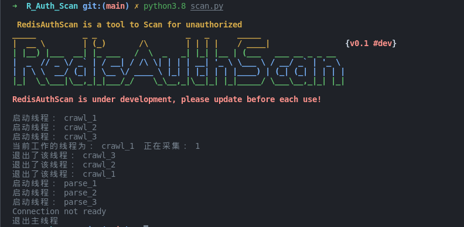
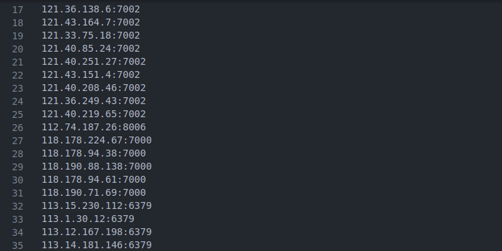

# R_Auth_Scan
基于 zoomeye(钟馗之眼) 扫描 redis 未授权和弱密码扫描 脚本

## 配置

zoomeye 配置
```
        zm = ZoomEye()
        zm.username = ''  # zoomeye 用户名
        zm.password = ''  # zoomeye 密码
```
弱密码:

```
passwds = ['redis','root','oracle','password','p@ssw0rd','abc123!','','admin','abc123']
```
### 运行



